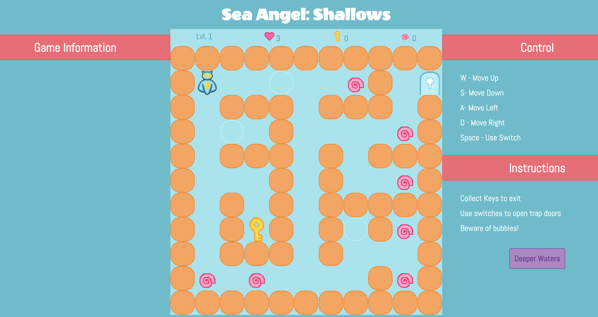
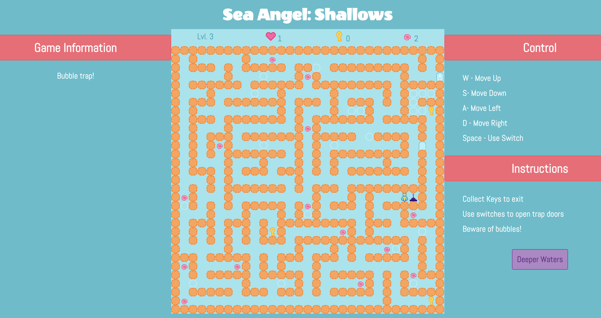
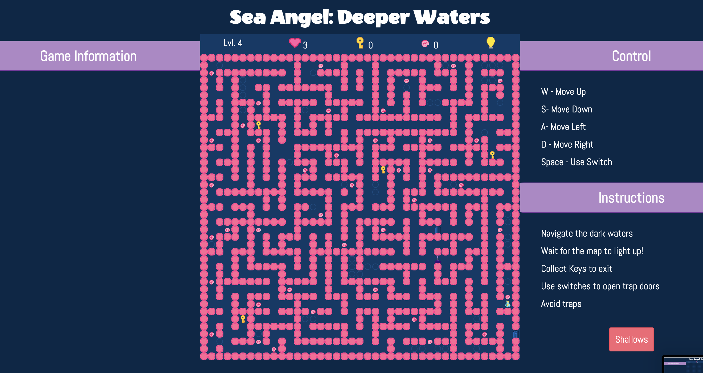

# Sea Angel

## Date: 24/01/24

## Version: 1.0

## By: Yasmeen Albalooshi

---

### Help the sea angel find its' home! Sea Angel: Shallows is a four level puzzle where players have to find their way to the exit. Following it is Sea Angel: Deeper Waters, a four level puzzle where players can only see a small area around them to navigate.

---

## Game Mechanics

### Sea Angel: Shallows:

#### The game utilizes the player's keyboard inputs. pressing any of: W, A, S, D keys will move the player one step in their respective direction. Pressing the space bar would pull a lever and open a door to a section of the maze. All the player has to do is move around the maze until they find the right path to reach the other end. The only issue is, they have to find the keys to exit.

### Sea Angel: Deeper Waters

#### In nightmare mode, the players have to navigate through the maze again **_BUT_** now they can only see a small area around them. They have to use their memory to find the right path and get out.

---

## Technologies used

- VS Code
- HTML
- CSS
- Javascript
- Procreate
- Trello
- Surge

---

## Game Links

[play the game](sea-angel.surge.sh) |
[Trello Board](https://trello.com/b/r7tWV1KZ/maze-game)

---

## Game Screenshots

#### Shallows: Level 1



#### Shallows: Level 1 Completion


#### Shallows: Level 2


#### Shallows: Level 3



#### Deeper Waters: level 2 lights on


#### Deeper Waters: level 2 lights off


#### Deeper Waters: level 4 lights on



#### Deeper Waters: level 4 lights off


---

## Game Code Preview

#### The entire game board grid is made up of divs. Event listeners are added on keys: W,A,S,D, and Space Bar. The following snippet of code moves the player's board location based on the key pressed down:

```javascript
const movePlayer = (updown = 0, leftright = 0) => {
  if (
    // not at the top wall
    player.boardLocation[0] + updown !== 0 &&
    // not at the bottom wall
    player.boardLocation[0] !== game.boardArray.length - 1 &&
    // not at the right wall
    player.boardLocation[1] !== game.boardArray[0].length &&
    // not at the left wall
    player.boardLocation[1] + leftright !== 0 &&
    // not moving into a wall
    game.boardArray[player.boardLocation[0] + updown][
      player.boardLocation[1] + leftright
    ] !== 1 &&
    // not moving into a switch
    game.boardArray[player.boardLocation[0] + updown][
      player.boardLocation[1] + leftright
    ] !== 7 &&
    //not moving into a trap door
    game.boardArray[player.boardLocation[0] + updown][
      player.boardLocation[1] + leftright
    ] !== 8
  ) {
    // check if next location is an exit
    if (
      checkIfExit(
        player.boardLocation[0] + updown,
        player.boardLocation[1] + leftright
      ) == true
    ) {
      // check if exit allowed
      if (canExitMaze()) {
        game.boardArray[player.boardLocation[0]][player.boardLocation[1]] = 0
        player.boardLocation[0] = player.boardLocation[0] + updown
        player.boardLocation[1] = player.boardLocation[1] + leftright
        // register the move on the board
        game.boardArray[player.boardLocation[0]][player.boardLocation[1]] = 2
        endGame('exit')
      } else {
        document.querySelector('.game-info').innerText = 'Missing some keys!'
      }
    } else {
      game.boardArray[player.boardLocation[0]][player.boardLocation[1]] = 0
      player.boardLocation[0] = player.boardLocation[0] + updown
      player.boardLocation[1] = player.boardLocation[1] + leftright
      checkLocation()
      // register the move on the board
      game.boardArray[player.boardLocation[0]][player.boardLocation[1]] = 2
      displayBoard()
    }
  }
}
```

## Future Enhancements

- Adding a timer
- improving overall display/graphics
- Generating maze arrays using AI
